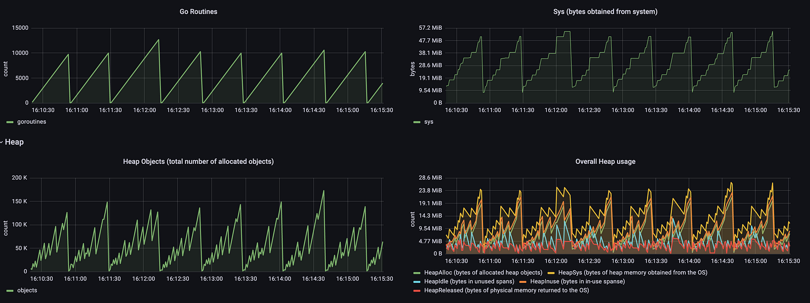

# Online In-Memory Task Processing
## Introduction
In the world of web services we quite often need to perform some actions that don’t affect the API response but should be done eventually. We usually call them background tasks.
Imagine scenarios that after processing user requests you need to send an audit log entry or analytical event. These two are not part of our business logic so users shouldn’t be affected by slowness or even unavailability of these functionality. That’s why we might want to perform these actions asynchronously to user requests.

Another use case is when after user request processing we need to create some extra entities related to the request but not directly affecting the response. Imagine we have a corporate user management system that receives requests for user creation. Once a user is created we may return its ID and asynchronously start the process of initialising the user's email and network storage and other resources that user will need to work with our system. Once the profile is fully initialised we may change the state of the user from ‘Pending’ to `Ready`. The total time of user initialisation may take a long time and may even involve some manual work of tech support or IT. So we can not perform it synchronously within user creation requests.

Sometimes we want to perform tasks daily, weekly or on some more complex schedule. Report generation, database partitioning routine, business metrics evaluation may work like this. We usually call this “batch job”. And this means that this background job is not related to online user request processing but runs independently according to schedule. Batch jobs may be computationally heavy and sometimes you may want to have checkpoints to be able to stop and then re-run it from the exact point without losing intermediate results.

To choose the right strategy of working with background tasks you need to classify each case and act accordingly. If you don’t pay attention to this then it may lead to slowness, memory leaks and even outage of your system.

In this post I will be mostly focused on Golang implementations of various online background task engines. I will briefly mention batch jobs but this is not the main subject of this post. I also use the words `task` and `job` interchangeably since in this context I don’t see any principal differences between them.

## Online In-Memory Task Processing
From one hand this is the most simple and performant way of running background tasks since you don't need any external storage to save them. On the other hand not all tasks may be performed this way since this model provides lower guarantee of task execution. Kubernetes may downscale your POD, AWS may interrupt your instance.

### Typical Initial State
Let's first define a scenario in which we may want to use background tasks.
```go
type UserRepository interface {
    Create(ctx context.Context, name, email string) (string, error)
}

type Analytics interface {
    Send(ctx context.Context, message string, args ...string)
}

type UserService struct {
    repo      UserRepository
    analytics Analytics
}

func (s *UserService) Create(ctx context.Context, name, email string) error {
    // create user in the database
    userID, _ := s.repo.Create(ctx, name, email)
    
    // send analytics event synchronously
    //
    // if analytics works slowly then this auxiliary
    // logic affects user creation business critical flow
    s.analytics.Send(ctx, "user created", userID)
    
    return nil
}
```
We have a service that saves users in a repository and then emits analytical events. You may notice that sending analytical events is an auxiliary operation. With or without these events we still create users and operate normally.
Assume that analytical service is having some performance issues and its latency has increased. Now the auxiliary step affects our business flow since User Service's clients notice the raise of latency and probably even see timeouts when creating a user.
We want to decouple our business critical and auxiliary parts of the system.

### Naive Worker Pool
```go
func (s *UserService) Create(ctx context.Context, name, email string) error {
   // create user in the database
   userID, _ := s.repo.Create(ctx, name, email)
  
   // send analytics event asynchronously
   //
   // IMPORTANT (1)
   // note that we disable context cancellation
   // for this goroutine to avoid cascading context
   // cancelling; prior to go1.21 you have to
   // write your own un-canceling function
   //
   // IMPORTANT (2)
   // this doesn't affect business critical flow
   // but this creates potential goroutine leak if analytics
   // works slowly or even hangs
   go s.analytics.Send(context.WithoutCancel(ctx), "user created", userID)

   return nil
}
```
Naive approach is not only naive. It is also wrong since it leads to goroutine and memory leak. We are responding to our clients normally but we have a bunch of goroutines that get stuck because of slowness in the analytical system.
This is a more or less standard pattern of the runtime metrics when leak is happening.


This goroutine leak to some extent may be mitigated by setting guard timeout for the analytics client but if requests are arriving faster than events are being sent then we still have goroutine leak.
```go
func (s *UserService) Create(ctx context.Context, name, email string) error {
   // create user in the database
   userID, _ := s.repo.Create(ctx, name, email)

   nonCancelableCtx := context.WithoutCancel(ctx)

   go func() {
      // we may set guard timeout,
      // this mitigates goroutine leak, but we still spawn
      // extra goroutine for each service request so under
      // some workload we may still have problems
      //
      // in other words we don't control the number of running
      // workers, clients do
      timeoutCtx, cancel := context.WithTimeout(
          nonCancelableCtx, 
          500*time.Millisecond, // <-
      )
      defer cancel()

      s.analytics.Send(timeoutCtx, "user created", userID)
   }()

   return nil
}
```

### Simple Worker Pool
Simple worker pool implies that you have some limited number of goroutines that are running and processing your tasks. To limit the number of goroutines we will use semaphore based on the golang channel. I minimise the use of external libraries in these code snippets but you may consider using the `golang.org/x/sync/semaphore`.
```go
type UserService struct {
    repo      UserRepository
    analytics Analytics

    // poolC is a buffered channel for using as semaphore;
    //
    // buffer size is a semaphore max counter size.
    poolC chan struct{}
}

func NewUserService(repo UserRepository, analytics Analytics) *UserService {
    return &UserService {
        // ...
        poolC: make(chan struct{}, 100) // <- semaphore with counter 100 
    }
}
```
In this scenario you have predictable resource consumption for the cost of worker pool exhaustion.
```go
func (s *UserService) Create(ctx context.Context, name, email string) error {
   // create user in the database
   userID, _ := s.repo.Create(ctx, name, email)

   select {
   // request timeout
   case <-ctx.Done():
      return ctx.Err()
   // acquire worker
   case s.poolC <- struct{}{}:
      // release worker
      defer func() { <-s.poolC }()
   // if all workers are busy
   // fallback to synchronous mode
   default:
      // optionally we may fail here
      // return errors.New("no workers available")
     
      // no matter what the parent request timeout is
      // we also set guard timeout here
      timeoutCtx, cancel := context.WithTimeout(ctx, 500*time.Millisecond)
      defer cancel()

      s.analytics.Send(timeoutCtx, "user created", userID)

      return nil
   }

   nonCancelableCtx := context.WithoutCancel(ctx)

   // send analytics event asynchronously
   go func() {
      // don't forget about guard timeout
      timeoutCtx, cancel := context.WithTimeout(
          nonCancelableCtx,
          500*time.Millisecond, // <-
      )
      defer cancel()

      s.analytics.Send(timeoutCtx, "user created", userID)
   }()

   return nil
}
```

### Advanced Worker Pool
Simple worker pool makes resource consumption predictable but we have either pool exhaustion or higher latency. If we could queue our tasks then we could process them more reliably.
```go
type Pool struct {
   // taskC is a task queue
   taskC chan func()
}

// NewPool creates worker pool of
// size goroutines running and ready
// to execute tasks.
func NewPool(size int) *Pool {
   // buffered channel that works as a task queue
   taskC := make(chan func(), size)

   // run limited number of workers
   for i := 0; i < size; i++ {
      go func() {
         // read from the task queue
         for task := range taskC {
            // execute the task
            task()
         }
      }()
   }

   return &Pool{taskC: taskC}
}
```

We also need a method for enqueuing tasks.

```go
// Task is public task function
// that receives task-scope context.
type Task func(taskCtx context.Context)

func (p *Pool) Enqueue(ctx context.Context, task Task) error {
   // note that we make the task context non-cancellable
   // to avoid cascading parent context cancellation
   taskCtx := context.WithoutCancel(ctx)

   select {
   case <-ctx.Done():
      return ctx.Err()
   case p.taskC <- func() { task(taskCtx) }:
      return nil
   }
}
```

Task queue allows us to handle spikes.
Since we start all workers at NewPool we also need a way of stopping them.

```go
// Stop stops all the workers.
func (p *Pool) Stop() {
   close(p.taskC)
}
```

All running workers will quit the for-loop automatically.

```go
func (p *Pool) Enqueue(ctx context.Context, task Task) error {
   // …
   select {
   // panics when taskC is closed
   case p.taskC <- func() { task(taskCtx) }: // <- panics if taskC is closed
      // …
   }
}
```

Implementing a shutdown mechanism is a very important part of cloud applications since they can be stopped at any time. Applications need to be stopped in a right or "graceful" manner.
After calling Stop we have two issues:
- Enqueue panics when taskC is closed
- Our pool doesn't wait for running tasks to finish

### Stoppable Panic-Free Pool
Standard Golang library gives us a perfect and simple toolset for synchronisation and orchestration of goroutines. Let's make use of it. We are adding three more fields into our pool structure: stopping flag, pool context and pool context cancel function.
```go
type Pool struct {
   // taskC is a task queue
   taskC chan func()

   // isStopping shows that the pool is stopping
   isStopping atomic.Bool

   // ctx is a pool context that signals that the pool is stopping
   ctx context.Context

   // cancel cancels pool context
   cancel func()
}

func NewPool(size int) *Pool {
   taskC := make(chan func(), size)

   poolCtx, cancel := context.WithCancel(context.Background())

   for i := 0; i < size; i++ {
      go func() {
         for {
            select {
            case task, ok := <-taskC:
               // safety check (in contrast to range)
               if !ok {
                  return
               }

               task()
            case <-poolCtx.Done():
               // pool is stopping
               return
            }

         }
      }()
   }

   return &Pool{
      taskC:  taskC,
      ctx:    poolCtx,
      cancel: cancel,
   }
}
```
Stop function now looks like this:
```go
func (p *Pool) Stop() {
   // set the stopping flag
   p.isStopping.Store(true)

   // send a signal to those who waits
   p.cancel()
}
```

Note that to avoid panic we now don't close taskC channel allowing some enqueuers to finish sending their tasks even after the Stop function being called.
Enqueue function now looks as follows:
```go
type Task func(taskCtx context.Context)

func (p *Pool) Enqueue(ctx context.Context, task Task) error {
   // do not allow enqueueing when pool is stopping
   if p.isStopping.Load() {
      return errors.New("pool is stopping")
   }

   // note that we make the task context non-cancellable
   // to avoid cascading parent context cancellation
   taskCtx := context.WithoutCancel(ctx)

   // note that all in-flight Enqueue at this point may
   // still send tasks to taskC because select operator
   // does not determine the order of cases;
   //
   // we can think of the second select but this complicates
   // the code and doesn't address the issue in full so let's
   // treat it as an edge case
   select {
   case <-ctx.Done():
      return ctx.Err()
   case <-p.ctx.Done():
      return errors.New("pool is stopping")
   case p.taskC <- func() { task(taskCtx) }:
      return nil
   }
}
```

### Gracefully Stoppable Pool
Panic-free pool is still not gracefully stoppable because it doesn't wait for running tasks to finish. Let's leverage wait groups, one of the common ways of waiting for a set of goroutines.
```go
type Pool struct {
   taskC chan func()
   isStopping atomic.Bool
   ctx context.Context
   cancel func()

   // wg is a WaitGroup for waiting all workers to finish
   wg *sync.WaitGroup // <-
}
```
Now we need to increment the wait group counter to make it equal to the number goroutines to wait.
```go
func NewPool(size int) *Pool {
   taskC := make(chan func(), size)
   poolCtx, cancel := context.WithCancel(context.Background())

   wg := sync.WaitGroup{} // <- 1

   for i := 0; i < size; i++ {
      wg.Add(1) // <- 2

      go func() {
         defer wg.Done() // <- 3

         for {
            select {
            case task, ok := <-taskC:
               // safety check
               if !ok {
                  return
               }

               task()
            case <-poolCtx.Done():
               // pool is stopping
               return
            }
         }
      }()
   }

   return &Pool{
      taskC:  taskC,
      ctx:    poolCtx,
      cancel: cancel,
      wg:     &wg,  // <-
   }
}
```
In the Stop function let's simply wait for all goroutines to finish.
```go
func (p *Pool) Stop() {
   p.isStopping.Store(true)

   p.cancel()

   p.wg.Wait()
}
```

Wait a moment. What if some of the tasks hangs then the Stop function also hangs. Let's handle this scenario by adding a stop waiting timeout.
```go
// Stop stops all the workers and waits for them to finish for a certain time.
func (p *Pool) Stop(timeout time.Duration) error {
   p.isStopping.Store(true)

   p.cancel()

   doneC := make(chan struct{})

   go func() {
      p.wg.Wait() // <- wait asynchronously
      close(doneC)
   }()

   select {
   case <-doneC:
      return nil
   case <-time.After(timeout):
      return errors.New("stop timeout")
   }
}
```

We may notice that all functions that we are calling after setting a stop flag are idempotent, thus the Stop function is also idempotent. So if someone mistakenly calls Stop function 10 times in a row nothing breaks. Let's make the Stop function idempotent regardless of implementation:
```go
func (p *Pool) Stop(timeout time.Duration) error {
   // now we are quitting the function everytime
   // if it has already being called
   if !p.isStopping.CompareAndSwap(false, true) {
       return nil
   }

   // …any other calls…

}
```

Now let's look at the contract between the pool and its workers. Pool gives workers some time to finish their tasks but it doesn't send a signal that it is about to stop. Let's simply extend the task interface by one more parameter: pool context.
```go
// Task is public Task interface
// that receives pool context for receiving
// stop signal from worker pool and task-scope
// context for everything else.
type Task func(poolCtx, taskCtx context.Context)

func (p *Pool) Enqueue(ctx context.Context, task Task) error {
   if p.isStopping.Load() {
      return errors.New("pool is stopping")
   }

   taskCtx := context.WithoutCancel(ctx)
   poolCtx := p.ctx

   select {
   case <-ctx.Done():
      return ctx.Err()
   case <-p.ctx.Done():
      return errors.New("pool is stopping")
   // pass pool context to the task
   case p.taskC <- func() { task(poolCtx, taskCtx) }:
      return nil
   }
}
```

Now this is a fair contract. No matter what task is doing it always has a chance to receive the pool stop signal:
```go
err := pool.Enqueue(context.Background(), func(poolCtx, taskCtx context.Context) {
   select {
   case <-taskCtx.Done():
      // task timed out or cancelled
   case <-poolCtx.Done():
      // pool is stopping
   }
})
```

You might be thinking why not to utilise task context for multiplexing different signals. Golang doesn't allow us to merge contexts. You can try to implement context merger yourself but I found that it is simpler just to extend the task interface.

### Dynamic Worker Pool
Let's try to make up some simple solution for creating a dynamic worker pool. In contrast to static workers, dynamic ones just quit after task execution. This solution is way more complex so I provide it just for fun.
Our pool structure now contains two extra fields: semaphore from the beginning of this post and stop mutex for handling wait group access races.
```go
type Pool struct {
   // taskC is a task queue
   taskC chan func()

   // wg is a WaitGroup for waiting all workers to finish
   wg *sync.WaitGroup

   // ctx is a pool context that signals that the pool is stopping
   ctx context.Context

   // cancel cancels pool context
   cancel func()

   // isStopping shows that the pool is stopping
   isStopping atomic.Bool

   // dynamicPoolC is a semaphore for running dynamic workers
   dynamicPoolC chan struct{} // <-

   // stopMutex protects wait group when stopping the pool
   stopMutex sync.Mutex // <-
}
```

To create dynamic worker pool we also need to change our constructor as follows
```go
// NewPool creates worker pool of
// minSize goroutines running and ready
// to execute tasks.
//
// If no static workers available it is
// able to extend the pool up to maxSize workers
// which quit after task execution.
func NewPool(minSize, maxSize int) (*Pool, error) {
   if minSize >= maxSize {
      return nil, fmt.Errorf(
                      "wrong pool size: minSize %d >= maxSize %d",
                       minSize, maxSize)
   }

   taskC := make(chan func(), minSize)
   wg := sync.WaitGroup{}
   poolCtx, cancel := context.WithCancel(context.Background())

   // run limited number of workers
   for i := 0; i < minSize; i++ {
      wg.Add(1)

      go func() {
         defer wg.Done()

         for {
            select {
            case task, ok := <-taskC:
               // safety check
               if !ok {
                  return
               }

               task()
            case <-poolCtx.Done():
               // pool is stopping
               return
            }

         }
      }()
   }

   return &Pool{
      taskC:        taskC,
      ctx:          poolCtx,
      cancel:       cancel,
      wg:           &wg,
      dynamicPoolC: make(chan struct{}, maxSize-minSize), 
   }, nil
}
```

Enqueue function transforms into this one. It is almost the same but contains the default section in the select operator.
```go
func (p *Pool) Enqueue(ctx context.Context, task Task) error {
   if p.isStopping.Load() {
      return errors.New("pool is stopping")
   }

   taskCtx := context.WithoutCancel(ctx)
   poolCtx := p.ctx

   select {
   case <-ctx.Done():
      return ctx.Err()
   case <-p.ctx.Done():
      return errors.New("pool is stopping")
   case p.taskC <- func() { task(poolCtx, taskCtx) }:
      return nil
   default:
      // if no static workers available then
      // try to schedule dynamic worker
      return p.enqueueDynamic(taskCtx, task)
   }
}
```

Where enqueueDynamic function is just an old good naive worker pool from the beginning of the post.
```go
func (p *Pool) enqueueDynamic(taskCtx context.Context, task Task) error {
   select {
   case <-taskCtx.Done():
      return taskCtx.Err()
   case <-p.ctx.Done():
      return errors.New("pool is stopping")
   // acquire worker
   case p.dynamicPoolC <- struct{}{}:
      // note that at this point Stop can be called,
      // acquire mutex to protect wait group counter
      // to be incremented after Wait being called in
      // Stop function
      p.stopMutex.Lock() // <-

      if p.isStopping.Load() {
         p.stopMutex.Unlock() // <-

         return errors.New("pool is stopping")
      }

      // this shouldn't happen after Wait
      p.wg.Add(1)

      p.stopMutex.Unlock() // <-

      // schedule dynamic worker
      go func() {
         // release worker
         defer func() { <-p.dynamicPoolC }()

         defer p.wg.Done()

         task(p.ctx, taskCtx)
      }()
   }

   return nil
}
```

We also need to adjust our stop function in order to handle wait group access races.
```go
func (p *Pool) Stop(timeout time.Duration) error {
   // to avoid calling wg.Wait before wg.Add in dynamicEnqueue
   // we have to introduce a critical section
   //
   // note that in this case using of atomic.Bool is unnecessary,
   // but we leave it just for code similarity,
   // it keeps the code safe even if you remove dynamic workers
   p.stopMutex.Lock() // <-
   defer p.stopMutex.Unlock() // <-

   // if the pool is already stopping then just quit
   if !p.isStopping.CompareAndSwap(false, true) {
      return nil
   }

   // …
}
```

Now it is enough.

## Other kinds of background tasks
We have had a closer look at the online in-memory task processing. But there are also other kinds of tasks. Let’s briefly review them.

### Online Persistent Tasks
You may want to be able to run your tasks even if your service restarted for more critical tasks like SMS or Email sending. These tasks are parts of critical business flows. For achieving this you need to use external storage as a task queue. It may be Redis, RabbitMQ or any other message broker or message queue.

### Online Transactional Tasks
In some cases you need to schedule tasks within database transactions. These tasks are also persistent but with more strict guaranties of execution. You write to the database and schedule tasks atomically. This is really important in financial systems and in the systems that use [event sourcing](https://microservices.io/patterns/data/event-sourcing.html). For implementing a transactional task engine you may refer to the pattern [Transactional Outbox](https://microservices.io/patterns/data/transactional-outbox.html) also known as `Outboxer`.

### Batch Jobs
You may also need to perform periodical or on-demand computational heavy tasks also known as Batch Jobs. These are usually not part of online business flows but are still really critical. Report generation, calculation of business metrics based on big database tables, marketing campaigns with sending hundreds of thousands user notifications. These all are examples of Batch Jobs. Not so obvious but running non-blocking applicational database migration also belongs to this kind. This is a really broad topic to describe it in one paragraph. Depending on your requirements you may consider [industrial solutions](https://en.wikipedia.org/wiki/Batch_processing) or crafting in-house one in the form of backend service, [Jenkins Job](https://www.jenkins.io/doc/book/using/working-with-projects/), [AWS Lambda](https://docs.aws.amazon.com/eventbridge/latest/userguide/eb-run-lambda-schedule.html), [Kubernetes Background Job](https://kubernetes.io/docs/concepts/workloads/controllers/job/), etc.

## Conclusion
In this post we reviewed online in-memory task processing. It has limited scope of application because of lower reliability compared to other kinds of task processing models. But it is relatively simple and performant. This is a tradeoff.

Important to note that we shouldn't forget about observability. Something that works and fails in the background is not visible immediately. Work on monitoring your task engine. Start from logging and simple metric counters for executed and failed jobs. This is the only way to measure if in-memory task processing works for you or you need to switch to a persistent task engine.

All code examples may be found in the [pool](pool) directory.

Thank you for reading. 
